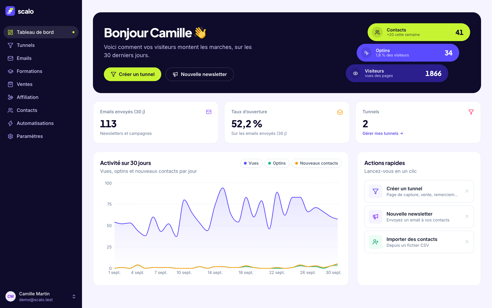
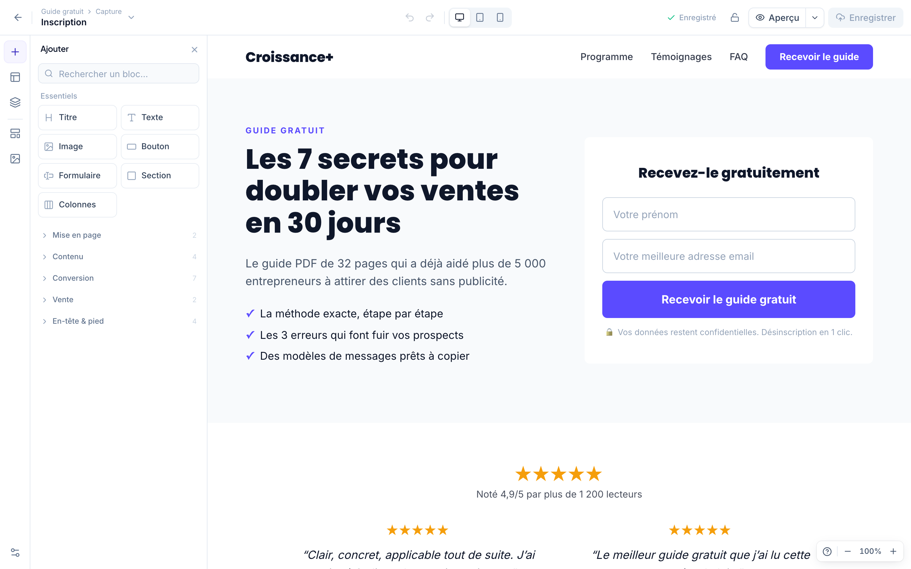
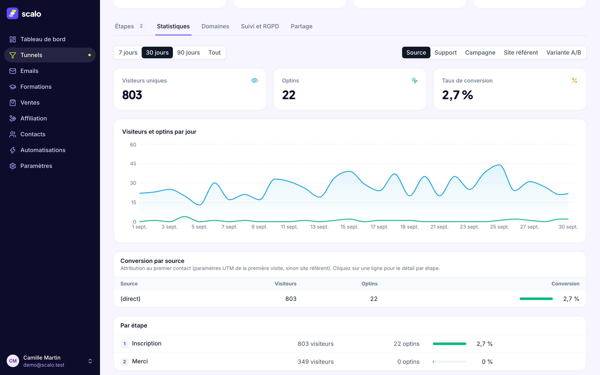

# Scalo

**The open-source alternative to all-in-one sales funnel platforms**: funnels and pages, emails, CRM, automations, payments and courses in a single application that you host yourself.

The core is licensed under the [AGPL-3.0](LICENSE), with no limit on contacts, emails or funnels. One-command install with Docker. The interface and the detailed documentation are in French for now ([README en français](README.md)); internationalisation is on the roadmap.



| Page builder | Funnel statistics |
|---|---|
|  |  |

## Features

- **Sales funnels** — steps, custom domains with automatic HTTPS, page A/B tests, statistics by source (UTM), tracking pixels and cookie banner, legal pages, export / import / share link
- **Page builder** — sections, columns, 24 block types, inline editing, media library, templates
- **Emails** — scheduled newsletters, subject A/B tests, automated campaigns with conditions, double opt-in, SPF / DKIM / DMARC checks, complaint and bounce webhooks
- **Contacts and CRM** — custom fields, tags, combined filters, segments, bulk actions, CSV import / export
- **Automations** — triggers, conditions, actions, delays, signed outgoing webhooks, execution log
- **Payments** — your own Stripe account: one-time, subscription, instalments, order bump, one-click upsell, refunds
- **Courses and members area** — modules and lessons, drip content, access by tag, magic-link login
- **Affiliate program** — tracking links, commissions on sales, payouts (being integrated)
- **AI** — funnels, campaigns and copy generated with the Claude API, with your own key
- **MCP server** — Claude, or any MCP client, works on your contacts, funnels and campaigns
- **Public API and OAuth 2.0** — `/api/v1`, OAuth 2.0 authorization server (PKCE, token rotation) for third-party apps
- **Migration** — contact import wizard (API key or CSV) and page import by URL, see [docs/migration.md](docs/migration.md)

## Quick start: self-hosting with Docker

You need a server with Docker, a domain name pointing to it, and ports 80 / 443 open.

```bash
git clone https://github.com/im-sacha-cohen/Scalo.git scalo && cd scalo
cp .env.example .env
./scripts/generate-secrets.sh --write        # JWT_SECRET, ENCRYPTION_KEY, POSTGRES_PASSWORD
# in .env: SCALO_DOMAIN=app.example.com
docker compose -f docker-compose.prod.yml up -d
```

Three containers start: the application (API, sending worker and web interface in one process), PostgreSQL 16 and Caddy (automatic HTTPS for your domain, on-demand certificates for the custom domains of funnels). Migrations are applied at startup.

Create your account at `https://app.example.com/register`, then close public sign-ups with `ALLOW_SIGNUPS=false` in `.env` if the instance is only for you.

| | |
|---|---|
| Back up | `./scripts/backup.sh` (database + files) |
| Restore | `./scripts/restore.sh backups/scalo-<date>` |
| Update | `./scripts/backup.sh && git pull && docker compose -f docker-compose.prod.yml up -d --build` |

Full guide: [docs/self-hosting.md](docs/self-hosting.md). Environment variables: [docs/configuration.md](docs/configuration.md).

## Development

Requires Node.js ≥ 20.12 and Docker (for a local PostgreSQL 16).

```bash
npm install
cp .env.example .env   # set JWT_SECRET
npm run db:up          # PostgreSQL in Docker (localhost:5433)
npm run migrate
npm run seed           # demo account: demo@scalo.test / demo1234
npm run dev            # http://localhost:5173
```

```
shared/  types + block rendering engine (editor, public pages, emails)
api/     Express + PostgreSQL (Kysely) + sending worker
web/     React + Vite + Tailwind
ee/      Enterprise edition, optional (commercial license)
```

`npm test` runs the integration tests against a real PostgreSQL database (`TEST_DATABASE_URL`), `npm run typecheck` checks the API and the web app. API contract and database design: [SPEC.md](SPEC.md).

## Editions

| | Community (AGPL-3.0) | Enterprise (`ee/`, commercial license) |
|---|---|---|
| Funnels, page builder, custom domains, A/B tests, statistics | yes, unlimited | yes |
| Emails, contacts, CRM, segments, automations | yes, unlimited | yes |
| Payments, courses and members area, affiliate program | yes | yes |
| AI, MCP server, public API, OAuth, webhooks, migration, self-hosting | yes | yes |
| "Powered by Scalo" mention on public pages and emails | shown, discreet | removable or replaceable |
| Team and roles, audit log, white label | — | yes |
| SSO / SAML, agency sub-accounts | — | planned |

Everything outside `ee/` is the complete product; nothing is restricted to push an upgrade. The core does not depend on `ee/`: delete the directory and the application still compiles, passes its tests and runs (`npm run check:core` proves it). The Enterprise license key is verified offline and an expired license never locks your data. Details: [ee/README.md](ee/README.md).

## Contributing

- [CONTRIBUTING.md](CONTRIBUTING.md) — setup, pull request checklist
- [CLA.md](CLA.md) — contributor license agreement, accepted in your first pull request
- [CODE_OF_CONDUCT.md](CODE_OF_CONDUCT.md)
- [SECURITY.md](SECURITY.md) — report vulnerabilities privately, never in a public issue

## License

Everything except the `ee/` directory: [GNU Affero General Public License v3.0](LICENSE). The `ee/` directory: [Scalo commercial license](ee/LICENSE), source-available.
