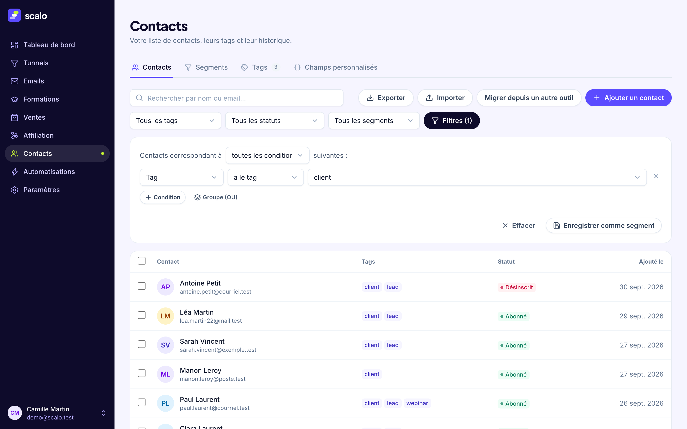
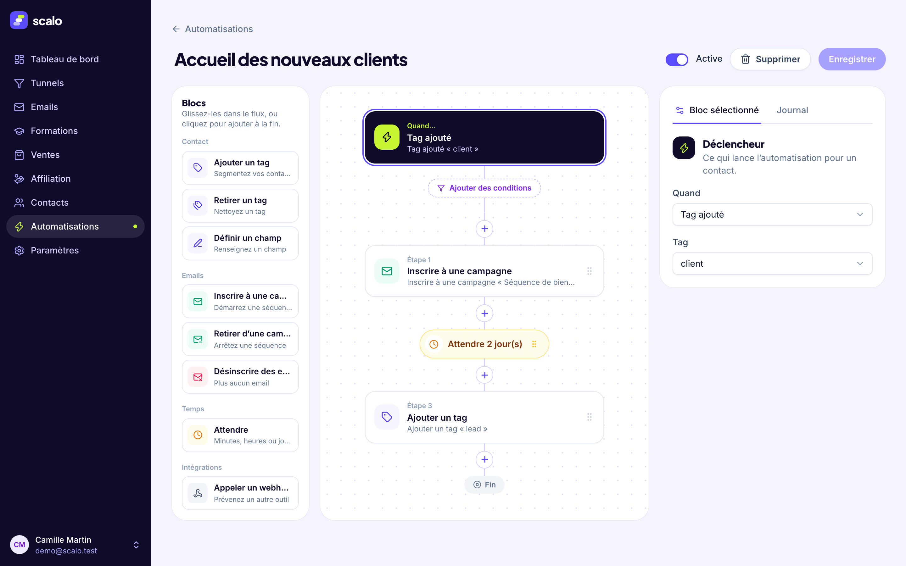
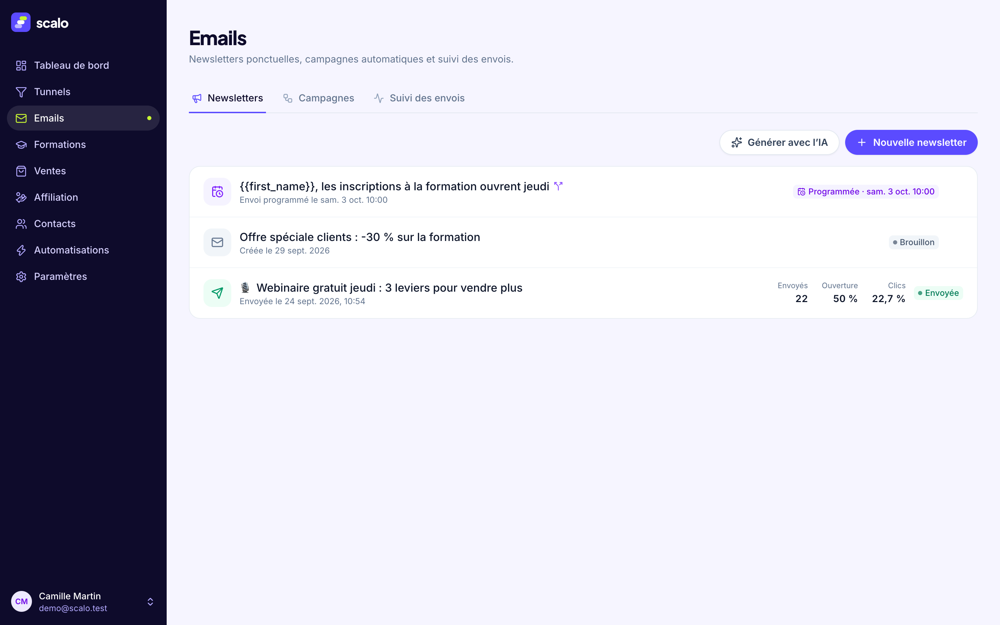

# Scalo

**L’alternative open source aux plateformes tout-en-un de tunnels de vente** : tunnels et pages, emails, CRM, automatisations, paiements et formations dans une seule application, que vous hébergez vous-même.

Cœur sous licence [AGPL-3.0](LICENSE), sans limite de contacts, d’emails ni de tunnels. Installation en une commande avec Docker. [English version](README.en.md).


| Éditeur de pages | Statistiques d'un tunnel |
|---|---|
|  |  |

| Contacts et segments | Automatisations |
|---|---|
|  |  |



## Fonctionnalités

| | | Documentation |
|---|---|---|
| **Tunnels de vente** | étapes, domaines personnalisés avec HTTPS automatique, tests A/B de pages, statistiques par source (UTM), pixels et bandeau cookies, pages légales, export / import / lien de partage | [docs/funnels.md](docs/funnels.md) |
| **Éditeur de pages** | sections, colonnes, 24 types de blocs, édition en ligne, médiathèque, modèles de pages et bibliothèque de sections | [SPEC.md](SPEC.md) |
| **Emails** | newsletters programmées, test A/B de l’objet, campagnes automatiques avec conditions, double opt-in, vérification SPF / DKIM / DMARC, plaintes et rebonds | [docs/emails.md](docs/emails.md) |
| **Contacts et CRM** | champs personnalisés, tags, filtres combinés, segments, actions groupées, import / export CSV | [docs/crm-automations.md](docs/crm-automations.md) |
| **Automatisations** | déclencheurs (formulaire, tag, achat, clic, webhook entrant…), conditions, actions, attentes, webhooks sortants signés, journal d’exécution | [docs/crm-automations.md](docs/crm-automations.md) |
| **Paiements** | votre propre compte Stripe : paiement unique, abonnement, paiement en plusieurs fois, order bump, upsell en un clic, remboursements | [docs/payments.md](docs/payments.md) |
| **Formations et espace membres** | modules et leçons, diffusion progressive, accès par tag ou manuel, connexion des membres par lien magique | [docs/courses.md](docs/courses.md) |
| **Affiliation** | programme d’affiliation : liens de suivi `?aff=`, commissions (%, fixe, par produit, récurrentes), validation après délai, remboursements, registre des paiements, espace affilié par lien magique | [docs/affiliation.md](docs/affiliation.md) |
| **IA** | génération de tunnels, de campagnes et de textes avec l’API Claude, avec votre propre clé | [docs/ai-mcp.md](docs/ai-mcp.md) |
| **Serveur MCP** | Claude, ou tout client MCP, agit sur vos contacts, tunnels et campagnes | [docs/ai-mcp.md](docs/ai-mcp.md) |
| **API publique et OAuth 2.0** | API `/api/v1`, serveur d’autorisation OAuth 2.0 (PKCE, rotation des jetons) pour les applications tierces, webhooks | [docs/api-oauth.md](docs/api-oauth.md) |
| **Migration** | assistant d’import des contacts (clé API ou CSV) et reprise de pages par URL | [docs/migration.md](docs/migration.md) |
| **Auto-hébergement** | image Docker, PostgreSQL, HTTPS automatique, sauvegarde et restauration | [docs/self-hosting.md](docs/self-hosting.md) |

## Démarrage rapide : auto-hébergement avec Docker

Il vous faut un serveur avec Docker, un nom de domaine qui pointe vers lui et les ports 80 / 443 ouverts.

```bash
git clone https://github.com/im-sacha-cohen/Scalo.git scalo && cd scalo
cp .env.example .env
./scripts/generate-secrets.sh --write        # JWT_SECRET, ENCRYPTION_KEY, POSTGRES_PASSWORD
# dans .env : SCALO_DOMAIN=app.exemple.fr
docker compose -f docker-compose.prod.yml up -d
```

Trois conteneurs démarrent : l’application (API, worker d’envoi et interface web dans un seul processus), PostgreSQL 16 et Caddy (certificat HTTPS automatique pour votre domaine, certificats à la demande pour les domaines personnalisés des tunnels). Les migrations sont appliquées au démarrage.

Créez ensuite votre compte sur `https://app.exemple.fr/register`, puis fermez les inscriptions publiques avec `ALLOW_SIGNUPS=false` dans `.env` si l’instance n’est que pour vous.

| | |
|---|---|
| Sauvegarder | `./scripts/backup.sh` (base + fichiers) |
| Restaurer | `./scripts/restore.sh backups/scalo-<date>` |
| Mettre à jour | `./scripts/backup.sh && git pull && docker compose -f docker-compose.prod.yml up -d --build` |

Guide complet (essai en local, reverse proxy existant, PostgreSQL hébergé, sécurité, limites) : [docs/self-hosting.md](docs/self-hosting.md). Variables d’environnement : [docs/configuration.md](docs/configuration.md).

## Démarrage développeur

Prérequis : Node.js ≥ 20.12 et Docker (pour PostgreSQL 16 en local) — ou n'importe quel PostgreSQL ≥ 13 hébergé.

```bash
npm install
cp .env.example .env   # puis ajustez JWT_SECRET
npm run db:up          # PostgreSQL dans Docker (localhost:5433)
npm run migrate        # crée / met à jour le schéma
npm run seed           # compte démo : demo@scalo.test / demo1234
npm run dev            # http://localhost:5173
```

Le serveur applique aussi les migrations en attente au démarrage (`AUTO_MIGRATE`), et s'arrête avec un message clair si la base est injoignable. Sans SMTP configuré (Paramètres), les emails ne partent pas : ils sont visibles dans Emails → Suivi des envois.

```
shared/  types + moteur de rendu des blocs (éditeur, pages publiques, emails)
api/     Express + PostgreSQL (Kysely + pg) + worker d'envoi — port 4000 (API_PORT)
web/     React + Vite + Tailwind — port 5173 (en développement, Vite transmet /api et les pages publiques à l'API)
ee/      édition Entreprise, optionnelle (licence commerciale) : équipe et rôles, journal d'audit, marque blanche
```

| Commande | Rôle |
|---|---|
| `npm run db:up` / `npm run db:down` | démarre / arrête le conteneur PostgreSQL (`docker compose`) |
| `npm run migrate` | applique les migrations en attente (`api/src/db/migrations/`) |
| `npm run migrate:down` | annule la dernière migration |
| `npm run migrate:status -w api` | liste les migrations appliquées |
| `npm run seed` | données de démo (ignoré si le compte démo existe) |
| `npm run seed -- --reset` | vide toutes les tables puis recrée la démo (refusé si `NODE_ENV=production`) |
| `npm test` | tests d'intégration (API + PostgreSQL réels, base `TEST_DATABASE_URL`) |
| `npm run typecheck` | vérification TypeScript api + web |
| `npm run build` | compile le front dans `web/dist` (servi par l’API en production) |

Contrat d'API complet, modèle de contenu des pages et architecture de la base : [SPEC.md](SPEC.md). Charte de marque : [`brand/BRAND.md`](brand/BRAND.md).

## Documentation

| Sujet | |
|---|---|
| Auto-hébergement : installation, sauvegarde, restauration, mise à jour | [docs/self-hosting.md](docs/self-hosting.md) |
| Variables d’environnement, PostgreSQL hébergé | [docs/configuration.md](docs/configuration.md) |
| Tunnels : domaines personnalisés et reverse proxy, tests A/B, statistiques, pixels, RGPD, partage | [docs/funnels.md](docs/funnels.md) |
| Emails : programmation, double opt-in, campagnes, délivrabilité | [docs/emails.md](docs/emails.md) |
| Contacts, segments, actions groupées, automatisations | [docs/crm-automations.md](docs/crm-automations.md) |
| Paiements (Stripe) | [docs/payments.md](docs/payments.md) |
| Formations et espace membres | [docs/courses.md](docs/courses.md) |
| Affiliation : programme, commissions, paiements aux affiliés, espace affilié | [docs/affiliation.md](docs/affiliation.md) |
| IA et serveur MCP | [docs/ai-mcp.md](docs/ai-mcp.md) |
| API publique, fournisseur OAuth 2.0, protection anti-brute-force | [docs/api-oauth.md](docs/api-oauth.md) |
| Migration depuis un autre outil | [docs/migration.md](docs/migration.md) |
| Édition Entreprise | [ee/README.md](ee/README.md) |
| Spécification technique (API, base de données) | [SPEC.md](SPEC.md) |

## Migrer depuis un autre outil

**Contacts → « Migrer depuis un autre outil »** ouvre un assistant : source, correspondance des champs, aperçu, import en arrière-plan, rapport.

- **Contacts par clé API** : import direct depuis systeme.io avec une clé API publique (champs personnalisés, tags, désinscriptions, date d’inscription).
- **Contacts par fichier CSV** : les exports de systeme.io, Mailchimp, Brevo, ActiveCampaign et Kit (ConvertKit) sont reconnus à leurs en-têtes ; tout autre CSV fonctionne avec la correspondance manuelle.
- **Pages** : reprise de la structure et des textes d’une page publique par son URL, sous forme de blocs modifiables.

Aucun email ne part par surprise : par défaut un import ne déclenche ni campagne ni automatisation, et les désinscrits restent désinscrits. Détails : [docs/migration.md](docs/migration.md).

*systeme.io, Mailchimp, Brevo, ActiveCampaign et Kit sont des marques de leurs propriétaires respectifs ; Scalo n’est affilié à aucun d’eux.*

## Éditions : communautaire et Entreprise

Scalo suit un modèle « open core » :

- **Édition communautaire** — tout ce qui est hors du dossier `ee/`, sous licence **[AGPL-3.0](LICENSE)**. C’est le produit complet, **sans aucune limite** de contacts, d’emails, de tunnels ou de domaines. Rien n’y est bridé pour pousser à l’achat.
- **Édition Entreprise** — le dossier [`ee/`](ee/README.md), au code visible mais sous **[licence commerciale](ee/LICENSE)** : il ne contient que des fonctions d’équipe et d’agence, activées par une clé de licence. Le lire et le modifier pour développer ou tester est permis ; l’utiliser en production demande un abonnement.

| | Communautaire (AGPL-3.0) | Entreprise (`ee/`, licence) |
|---|---|---|
| Tunnels, éditeur de pages, domaines personnalisés, tests A/B, statistiques | oui, illimité | oui |
| Emails : newsletters, campagnes, double opt-in, délivrabilité | oui, illimité | oui |
| Contacts, CRM, segments, automatisations | oui, illimité | oui |
| Paiements Stripe, formations et espace membres, affiliation | oui | oui |
| IA (avec votre clé), serveur MCP | oui | oui |
| API publique, fournisseur OAuth, webhooks | oui | oui |
| Migration depuis un autre outil | oui | oui |
| Auto-hébergement (Docker), sauvegarde et restauration | oui | oui |
| Mention « Propulsé par Scalo » (pages publiques et emails) | affichée, discrète | retirable ou remplaçable |
| **Équipe et rôles** — inviter des collaborateurs (administrateur, éditeur, lecture seule) | — | oui |
| **Journal d’audit** — qui a fait quoi, export CSV, durée de conservation | — | oui |
| **Marque blanche** — mention, nom et logo de l’interface | — | oui |
| SSO / SAML, sous-comptes d’agence | — | à venir |

**Le cœur ne dépend pas de `ee/`.** Vous pouvez supprimer le dossier : l’application compile, passe ses tests et tourne (deux registres seulement le chargent s’il existe : `api/src/ee.ts` et `web/src/lib/ee.ts`). Pour le vérifier, ou pour ignorer le dossier sans le supprimer :

```bash
npm run check:core               # copie le dépôt sans ee/ dans un dossier temporaire : typecheck + tests
SCALO_DISABLE_EE=1 npm run dev   # édition communautaire, ee/ laissé en place (VITE_SCALO_DISABLE_EE=1 côté web)
```

**Licence Entreprise.** La clé est un jeton signé (Ed25519) vérifié **hors ligne** sur votre serveur — aucune donnée n’est envoyée à Scalo. Fournissez-la par la variable `SCALO_LICENSE_KEY`, ou saisissez-la dans **Paramètres → Licence** (réservé au propriétaire du premier compte de l’instance). Elle indique le client, l’offre, les fonctions, le nombre de sièges par compte et la date d’expiration. À l’expiration : un bandeau discret, 14 jours de grâce, puis les fonctions Entreprise se désactivent — **vos données et le cœur ne sont jamais bloqués** (le propriétaire garde l’accès complet, le journal d’audit reste exportable, la mention « Propulsé par Scalo » réapparaît).

**Rôles** (édition Entreprise). Chaque collaborateur se connecte avec son propre email et mot de passe et agit sur le compte qui l’a invité ; les permissions sont appliquées par l’API.

| Rôle | Droits |
|---|---|
| Propriétaire | tout |
| Administrateur | tout, y compris paramètres et équipe ; pas la licence ni la suppression du compte |
| Éditeur | tunnels, emails, contacts, automatisations ; pas les paramètres, la facturation, l’équipe |
| Lecture seule | consultation uniquement |

| Commande | Rôle |
|---|---|
| `npm run test:ee` | tests de l’édition Entreprise (licence, équipe, permissions, audit, marque blanche) |
| `npm run typecheck:ee` | vérification TypeScript de `ee/api` et `ee/web` |
| `npm run check:core` | prouve que le cœur compile et passe ses tests sans `ee/` |
| `npm run ee:license -- …` | émission des clés de licence (réservé à l’éditeur, voir [`ee/README.md`](ee/README.md)) |

Format des clés, API, structure du dossier et prochaines étapes : [`ee/README.md`](ee/README.md).

## Contribuer

Les contributions sont bienvenues : corrections directement en pull request, fonctionnalités après une issue pour s’accorder sur le périmètre.

- [CONTRIBUTING.md](CONTRIBUTING.md) — installation, liste de vérification d’une pull request, organisation du dépôt
- [CLA.md](CLA.md) — accord de contribution, à accepter dans votre première pull request
- [CODE_OF_CONDUCT.md](CODE_OF_CONDUCT.md) — code de conduite
- [SECURITY.md](SECURITY.md) — signaler une faille de sécurité en privé, jamais dans une issue publique

## Licence

- Tout le dépôt, à l’exception du dossier `ee/` : [GNU Affero General Public License v3.0](LICENSE). Si vous modifiez Scalo et le proposez comme service en ligne, vous devez publier vos modifications sous la même licence.
- Le dossier `ee/` : [licence commerciale Scalo](ee/LICENSE), code visible.
